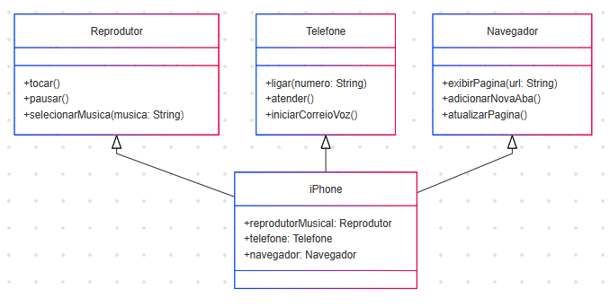

# Desafio iPhone - Modelagem e Implementação

Este repositório contém a modelagem UML e a implementação em Java do iPhone, com suas principais funcionalidades de **Reprodutor Musical**, **Aparelho Telefônico** e **Navegador na Internet**.

## Funcionalidades
O sistema simula três funcionalidades básicas de um iPhone:

1. **Reprodutor Musical**: Tocar, pausar e selecionar músicas.
2. **Aparelho Telefônico**: Ligar, atender e iniciar correio de voz.
3. **Navegador na Internet**: Exibir páginas, adicionar novas abas e atualizar páginas.

## Estrutura de Pacotes
O código está organizado nos seguintes pacotes:
- `interfaces`: Contém as interfaces que definem os métodos.
- `reprodutor`: Implementação do Reprodutor Musical.
- `telefone`: Implementação do Aparelho Telefônico.
- `navegador`: Implementação do Navegador na Internet.
- `iphone`: Classe principal que utiliza os componentes.

## Diagrama UML

Abaixo está o diagrama UML que representa as funcionalidades do iPhone:

